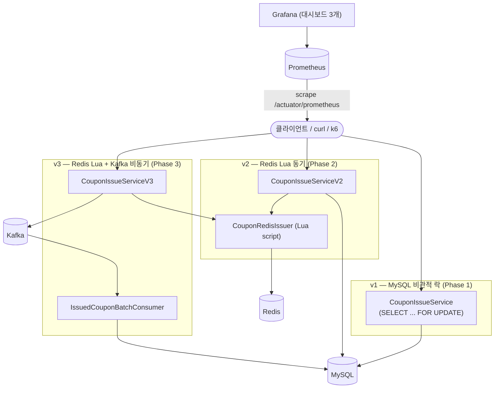

# coupon-event

선착순 쿠폰 발급 시스템의 동시성 문제를 3단계로 점점 어렵게 풀어보는 학습 프로젝트다. 같은 문제(재고 경합)를 MySQL 비관적 락 → Redis Lua 원자적 차감 → Redis + Kafka 비동기 영속화 순서로 세 번 풀고, 마지막에 Prometheus + Grafana로 실제 병목을 실측 검증한다.

이 문서는 **로컬에서 처음부터 끝까지 직접 실행하고 테스트해보기 위한 가이드**다. 각 Phase의 세부 설계/구현 배경은 아래 "문서 지도" 절의 링크를 참고한다.

## 0. 사전 준비물

- Docker Desktop (또는 Docker Engine + Compose v2) — `docker compose version`으로 확인
- JDK 21 (`./gradlew`가 Gradle 배포판을 알아서 받아오므로 JDK만 있으면 됨)
- [k6](https://k6.io/docs/get-started/installation/) — 부하테스트용 (`which k6`로 확인, 없으면 자동화 테스트/수동 curl 테스트는 그대로 가능하고 k6 부분만 건너뛰면 됨)

## 1. 전체 아키텍처 한눈에 보기



| Phase | 경로 prefix | 핵심 기술 | 목표 TPS |
|---|---|---|---|
| 1 | `/api/v1/...` | MySQL `SELECT ... FOR UPDATE` | ~100 |
| 2 | `/api/v2/...` | Redis Lua Script 원자적 차감 | ~1,000 |
| 3 | `/api/v3/...` | Redis 동기 차감 + Kafka 비동기 DB 반영 | ~10,000 |

v3는 별도 관리자 API가 없다 — 이벤트 생성은 v2의 `/api/v2/admin/coupon-events`를 그대로 쓴다.

## 2. 인프라 기동 — 두 가지 모드

이 프로젝트는 **개발용(가벼움)** 과 **관측용(전체 스택)** 두 모드를 지원한다. docker-compose profile로 나뉘어 있어서 명령어 하나로 전환된다.

### 2-1. 개발 모드 — 인프라만 컨테이너, 앱은 호스트에서 직접 실행

빠른 재시작이 필요한 평소 개발 작업에 쓴다.

```bash
docker compose up -d          # MySQL(3306) + Redis(6379) + Kafka(9092)만 뜬다
./gradlew bootRun             # 앱은 호스트에서 직접 (포트 8080)
```

기동 확인(Kafka 초기화 때문에 20~30초 정도 걸릴 수 있다):

```bash
curl -s -o /dev/null -w "HTTP %{http_code}\n" http://localhost:8080/api/v2/admin/coupon-events
```

### 2-2. 관측 모드 — 앱까지 포함해 전체 스택을 컨테이너로

Prometheus/Grafana로 실시간 관찰하며 테스트하고 싶을 때 쓴다. 이미지를 빌드하므로 재시작이 느리지만 환경이 하나로 통일된다.

```bash
docker compose --profile monitoring up -d --build
docker compose ps             # app이 (healthy)가 될 때까지 기다린다
```

`app`이 `(healthy)`가 되면 `prometheus`가 자동으로 스크레이핑을 시작한다(compose healthcheck로 순서가 보장되어 있음). 두 모드 모두 `docker compose down`으로 정리한다.

**주의**: 두 모드를 동시에 쓰지 않는다 — 개발 모드로 `bootRun`을 띄운 상태에서 관측 모드까지 켜면 포트 8080이 충돌한다. `docker compose ps`로 뭐가 떠 있는지 항상 먼저 확인하자.

## 3. 자동화 테스트 실행

```bash
docker compose up -d          # 최소한 mysql/redis/kafka는 떠 있어야 한다
./gradlew test
```

50개 테스트(단위 + Redis/Kafka/MySQL 대상 통합 테스트 포함)가 전부 통과해야 한다. 특히 `CouponIssueConcurrencyV3Test` 같은 동시성 테스트는 실제 인프라에 직접 붙어서 검증하므로 컨테이너가 떠 있지 않으면 실패한다.

## 4. 손으로 직접 발급 요청 해보기

아래는 v1/v2/v3를 나란히 비교하는 최소 예시다. 각 Phase의 더 상세한 시나리오(중복 발급, 재고 소진, PENDING 상태 관찰 등)는 문서 지도의 `manual-testing-guide.md`를 참고한다.

### v1 — MySQL 락

```bash
curl -X POST http://localhost:8080/api/v1/admin/coupon-events \
  -H "Content-Type: application/json" \
  -d '{"name":"v1-test","totalQuantity":3,"startAt":"2020-01-01T00:00:00"}'
# 응답의 id를 EVENT_ID로 기억

curl -i -X POST http://localhost:8080/api/v1/coupon-events/EVENT_ID/issue \
  -H "Content-Type: application/json" -d '{"userId":1}'
```

### v2 — Redis Lua (동기)

```bash
curl -X POST http://localhost:8080/api/v2/admin/coupon-events \
  -H "Content-Type: application/json" \
  -d '{"name":"v2-test","totalQuantity":3,"startAt":"2020-01-01T00:00:00"}'

curl -i -X POST http://localhost:8080/api/v2/coupon-events/EVENT_ID/issue \
  -H "Content-Type: application/json" -d '{"userId":1}'
```

### v3 — Redis Lua + Kafka (비동기)

v3는 관리자 API가 없다 — v2로 만든 이벤트를 그대로 쓴다.

```bash
curl -i -X POST http://localhost:8080/api/v3/coupon-events/EVENT_ID/issue \
  -H "Content-Type: application/json" -d '{"userId":2}'

# 응답은 즉시 오지만 DB 반영은 컨슈머가 비동기로 처리한다 — 상태로 직접 확인
curl -s http://localhost:8080/api/v3/coupon-events/EVENT_ID/users/2/status
# {"status":"PENDING"} 이었다가 곧 {"status":"COMPLETED"}로 바뀐다
```

모든 발급 경로는 재고 소진 시 `410`, 중복 발급 시 `409`를 응답한다.

## 5. 부하테스트 (k6)

```bash
# 예: v2 부하테스트
curl -X POST http://localhost:8080/api/v2/admin/coupon-events \
  -H "Content-Type: application/json" \
  -d '{"name":"load-test","totalQuantity":50000,"startAt":"2020-01-01T00:00:00"}'

EVENT_ID=<위에서 받은 id> k6 run load-test/k6/phase2-issue.js
```

`load-test/k6/phase1-issue.js` / `phase2-issue.js` / `phase3-issue.js` 세 스크립트가 각 Phase에 대응한다. 실제 측정된 수치와 결론은 `load-test/README.md`에 정리돼 있다(Phase 2 절의 "모니터링으로 실측 검증" 부분이 특히 흥미롭다 — 아래 6절 참고).

## 6. 모니터링 대시보드로 직접 관찰하기

관측 모드(2-2절)로 전체 스택을 띄운 상태에서:

- **Grafana**: http://localhost:3000 (로그인 없이 바로 들어가짐 — 로컬 전용 익명 Admin)
  - `coupon-event` 폴더 안에 대시보드 3개: **풀 병목 검증**(HikariCP/Tomcat/처리량), **API 버전 비교**(v1/v2/v3 req/s·p95), **Kafka Lag & JVM**
- **Prometheus**: http://localhost:9090 — 쿼리창에서 `hikaricp_connections_active`, `tomcat_threads_busy_threads`, `kafka_consumergroup_lag` 등을 직접 조회 가능

5절의 k6 부하테스트를 돌리면서 "풀 병목 검증" 대시보드를 계속 보고 있으면, HikariCP 커넥션 풀(10개)과 Tomcat 스레드 풀(200개)이 실제로 포화되는 순간을 눈으로 확인할 수 있다 — 이게 이 프로젝트가 실측으로 검증해낸 핵심 결과다.

## 7. 자주 겪는 문제 (트러블슈팅)

| 증상 | 원인 / 해결 |
|---|---|
| 앱 기동이 20~30초씩 걸림 | Kafka consumer/producer 초기화 때문에 정상적으로 느리다. `curl`이 연결 거부를 반환하면 좀 더 기다렸다가 재시도. |
| `docker compose up -d`만 했는데 포트 8080이 이미 쓰이고 있다는 에러 | 개발 모드와 관측 모드를 동시에 켠 것. `docker compose ps`로 확인 후 하나를 내린다(`docker compose --profile monitoring down` 또는 `bootRun` 프로세스 종료). |
| `docker compose up -d`(옵션 없음)를 했는데 `app`/`prometheus`/`grafana`가 안 뜸 | 의도된 동작이다 — 그 서비스들은 `monitoring` profile 뒤에 있다. `docker compose --profile monitoring up -d --build`로 띄운다. |
| Kafka consumer가 브로커에 연결 못 함(컨테이너 안에서) | Kafka는 리스너가 2개다: 호스트용(`localhost:9092`)과 컨테이너 네트워크 내부용(`kafka:29092`). 새로 컨테이너 클라이언트를 추가한다면 반드시 `kafka:29092`를 써야 한다 — `docker-compose.yml`의 `kafka:` 서비스 위 주석 참고. |
| `coupon-issue-events` 토픽이 없다는 에러 | 앱이 `KafkaTopicConfig`의 `NewTopic` 빈으로 기동 시 자동 생성한다(파티션 3개). 수동 생성이 필요하다면: `docker compose exec kafka /opt/kafka/bin/kafka-topics.sh --create --topic coupon-issue-events --partitions 3 --replication-factor 1 --bootstrap-server localhost:9092` |
| `./gradlew test`의 동시성/통합 테스트가 실패함 | mysql/redis/kafka가 실제로 떠 있어야 한다(Testcontainers를 쓰지 않는 프로젝트 방침). `docker compose ps`로 확인. |

## 8. 문서 지도

전체 흐름을 다이어그램으로 빠르게 보고 싶다면 각 Phase의 `00-summary.md`가 가장 압축적이다.

| Phase | 설계 | 계획 | 요약(다이어그램) | 수동 테스트 가이드 |
|---|---|---|---|---|
| 로드맵 전체 | `docs/superpowers/specs/2026-07-04-coupon-event-design.md` | — | — | — |
| Phase 1 | `docs/superpowers/specs/...` (로드맵에 포함) | `docs/superpowers/plans/2026-07-05-phase1-mysql-lock.md` | `docs/superpowers/reports/2026-07-05-phase1-mysql-lock/00-summary.md` | 같은 폴더의 `manual-testing-guide.md` |
| Phase 2 | `docs/superpowers/specs/2026-07-11-phase2-redis-lua-design.md` | `docs/superpowers/plans/2026-07-11-phase2-redis-lua.md` | `docs/superpowers/reports/2026-07-11-phase2-redis-lua/00-summary.md` | 같은 폴더의 `manual-testing-guide.md` |
| Phase 3 | `docs/superpowers/specs/2026-08-13-phase3-kafka-async-design.md` | `docs/superpowers/plans/2026-08-13-phase3-kafka-async.md` | `docs/superpowers/reports/2026-08-13-phase3-kafka-async/00-summary.md` | 같은 폴더의 `manual-testing-guide.md` |
| 모니터링 | `docs/superpowers/specs/2026-08-15-monitoring-observability-design.md` | `docs/superpowers/plans/2026-08-15-monitoring-observability.md` | — | `docs/superpowers/reports/2026-08-15-monitoring-observability/manual-testing-guide.md` |

부하테스트 실측 수치와 결론은 `load-test/README.md` 하나에 Phase별로 누적 정리돼 있다.
