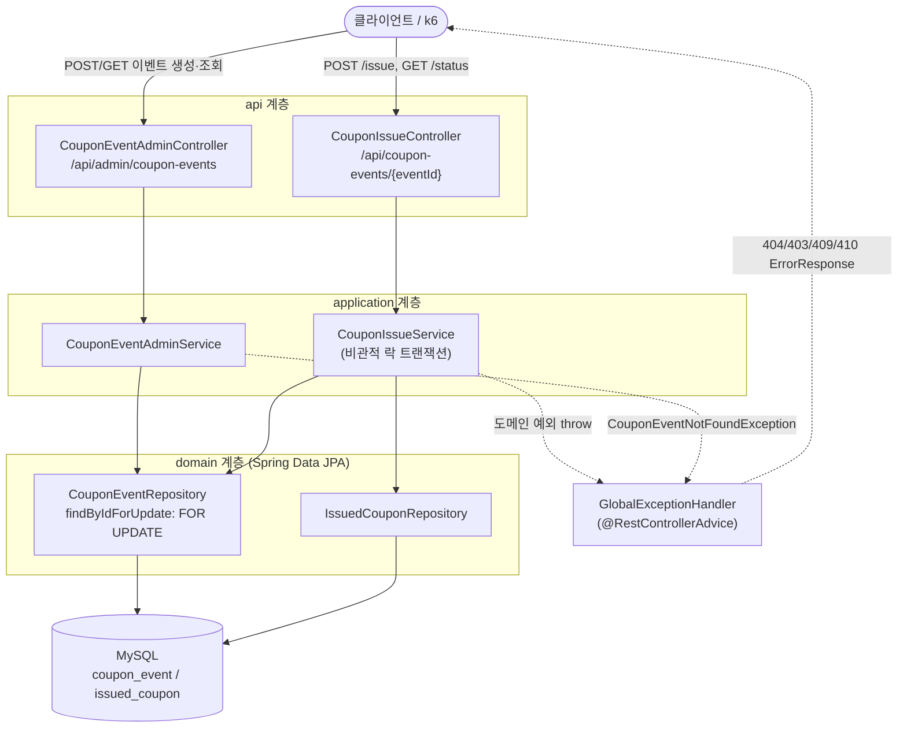

# Phase 1 (MySQL 비관적 락) 구현 결과 요약

- 계획: `docs/superpowers/plans/2026-07-05-phase1-mysql-lock.md`
- 스펙: `docs/superpowers/specs/2026-07-04-coupon-event-design.md`
- 브랜치: `worktree-phase1-mysql-lock`
- PR: [#1 Phase 1: MySQL 비관적 락 기반 선착순 쿠폰 발급](https://github.com/JuHyun419/coupon-events/pull/1)
- 이 디렉터리의 문서는 계획서에 있던 Task 1~8을 **실제로 무엇을 했는지, 계획과 무엇이 달랐는지, 검증 결과가 무엇인지** 기준으로 각 Task당 하나의 파일로 정리한 것이다. 계획서 자체(체크박스)는 실행 중 갱신하지 않았으므로 이 문서들이 실행 기록의 유일한 소스다.

## 전체 아키텍처

3계층(controller/application/domain) + 전역 예외 핸들러로 구성된다. `CouponIssueService`만 `SELECT ... FOR UPDATE`로 락을 잡고, 나머지는 평범한 JPA 흐름이다.

각 요소가 실제로 어떻게 동작하는지는 Task별 문서에 더 자세한 시퀀스 다이어그램으로 정리했다 — 발급 로직의 판정 순서는 [Task 5](task-5-issue-service.md), 요청~응답 전체 흐름은 [Task 6](task-6-issue-api.md), 동시성 상황은 [Task 7](task-7-concurrency-test.md) 참고.

## Task 목록

| Task | 파일 | 커밋 |
|---|---|---|
| 1 | [task-1-deps-infra.md](task-1-deps-infra.md) | `40c4836` |
| 2 | [task-2-entities-repositories.md](task-2-entities-repositories.md) | `8572e0d` |
| 3 | [task-3-exceptions.md](task-3-exceptions.md) | `658e1dd` |
| 4 | [task-4-admin-api.md](task-4-admin-api.md) | `a2a92b6` |
| 5 | [task-5-issue-service.md](task-5-issue-service.md) | `ea70c2e` |
| 6 | [task-6-issue-api.md](task-6-issue-api.md) | `64e3083` |
| 7 | [task-7-concurrency-test.md](task-7-concurrency-test.md) | `992bc5c` |
| 8 | [task-8-load-test.md](task-8-load-test.md) | `3abaf75` |

직접 API를 호출하고 락을 손으로 느껴보고 싶다면 [manual-testing-guide.md](manual-testing-guide.md) 참고.

## 계획 대비 주요 편차

Spring Boot **4.1.0**은 계획 작성 시점에 가정했던 패키지/모듈 구조와 달라서, 실행 중 두 차례 계획을 벗어난 수정이 필요했다:

1. **테스트 모듈 분할** — `spring-boot-test-autoconfigure` 하나에 있던 `@DataJpaTest`, `@AutoConfigureTestDatabase`, `@WebMvcTest` 등이 기능별 서브모듈(`spring-boot-data-jpa-test`, `spring-boot-jdbc-test`, `spring-boot-webmvc-test`)로 쪼개졌다. `build.gradle.kts`에 `spring-boot-starter-data-jpa-test`(Task 2), `spring-boot-starter-webmvc-test`(Task 6)를 추가하고 import 경로를 새 패키지로 맞췄다. 자세한 내용은 각 Task 문서 참고.
2. **Jackson 3 전환** — Spring Boot 4.1은 Jackson 2(`com.fasterxml.jackson.*`)가 아니라 Jackson 3(`tools.jackson.*`)를 쓴다. `CouponIssueControllerTest`의 `ObjectMapper` import를 `tools.jackson.databind.ObjectMapper`로 수정했다 (Task 6).
3. **MySQL 8 인증 플러그인** — `application.yml`의 JDBC URL에 `allowPublicKeyRetrieval=true`를 추가했다. MySQL 8 기본 인증 플러그인(`caching_sha2_password`)이 비-SSL 연결에서 공개키를 요구하기 때문이다 (Task 2).

## 최종 검증 결과

- `./gradlew test` 전체 스위트 통과 (단위 + `@DataJpaTest`/`@WebMvcTest`/`@SpringBootTest` 통합 테스트 포함, 실제 로컬 MySQL 대상)
- 동시성 통합 테스트: 재고 100개 / 동시 요청 200건 → 정확히 100건 성공, 100건 실패, DB row 수 100 (Task 7)
- k6 부하테스트 (~100 TPS, 30초): 실제 처리량 97.77 req/s, p95 지연 1.04s, max 1.69s, `dropped_iterations` 67건 → 비관적 락에 의한 요청 직렬화 병목을 실측으로 확인 (Task 8)

## 다음 단계

Phase 2(Redis Lua Script 기반 원자적 재고 차감)는 이 계획/보고서의 범위 밖이며, Task 8에서 실측한 락 경합 병목을 근거로 별도 계획 문서로 착수한다.
