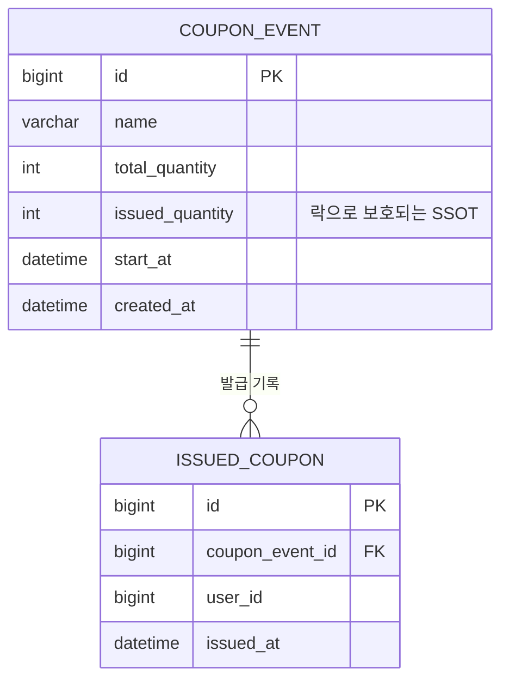

# Task 2: 도메인 엔티티 + 리포지토리 (CouponEvent, IssuedCoupon)

**커밋:** `8572e0d` Add CouponEvent/IssuedCoupon entities and repositories

## 데이터 모델

`issued_coupon`의 `uk_event_user (coupon_event_id, user_id)` UNIQUE 제약은 다이어그램에는 드러나지 않지만, 애플리케이션 레벨 중복 체크(`existsByCouponEventIdAndUserId`)가 경쟁 상태로 뚫리더라도 DB가 막아주는 최종 방어선이다.

## 한 일

- `CouponEvent` JPA 엔티티 (`coupon.domain`) — `name`, `totalQuantity`, `startAt`, `issuedQuantity`(var), `createdAt`
- `IssuedCoupon` JPA 엔티티 — `couponEventId`, `userId`, `issuedAt`,
  `UniqueConstraint(coupon_event_id, user_id)`로 1인 1매 제한의 최종 방어선을 DB 레벨에 둠
- `CouponEventRepository`
  - `findByIdForUpdate(id)` — `@Lock(LockModeType.PESSIMISTIC_WRITE)` + `@Query`로 `SELECT ... FOR UPDATE` 구현.
    표준 `findById`(Optional 반환, 락 없음)와 이름을 다르게 둬서 "이 메서드는 락을 잡는다"는 걸 호출부에서 바로 알 수 있게 했다.
  - `findByNameContaining(name)` — 관리자 조회용 파생 쿼리
- `IssuedCouponRepository` — `existsByCouponEventIdAndUserId`, `countByCouponEventId`
- `IssuedCouponRepositoryTest` — 실제 로컬 MySQL(docker-compose)에 붙여서 검증
  - 동일 이벤트-사용자 조합 중복 저장 시 `DataIntegrityViolationException` 발생 확인
  - `findByIdForUpdate`가 존재하는 이벤트를 정상 반환하는지 확인

## 계획과 다른 점

Spring Boot 4.1.0에서 `@DataJpaTest`/`@AutoConfigureTestDatabase`가 계획에서 가정한 패키지
(`org.springframework.boot.test.autoconfigure.orm.jpa`)에 있지 않고, 기능별로 분리된 서브모듈로 이동했다:

- `build.gradle.kts`에 `testImplementation("org.springframework.boot:spring-boot-starter-data-jpa-test")` 추가
- import 변경:
  - `org.springframework.boot.data.jpa.test.autoconfigure.DataJpaTest`
  - `org.springframework.boot.jdbc.test.autoconfigure.AutoConfigureTestDatabase`

또한 `application.yml`의 JDBC URL에 `allowPublicKeyRetrieval=true`를 추가했다 — MySQL 8 기본 인증 플러그인
(`caching_sha2_password`)이 비-SSL 연결에서 공개키 조회를 요구하기 때문에, 이게 없으면 실제 MySQL에 접속하는
테스트/애플리케이션이 인증 단계에서 실패한다.

## 검증

- `./gradlew test --tests "jh.couponevent.coupon.domain.IssuedCouponRepositoryTest"` → `BUILD SUCCESSFUL`, 2 tests passed
