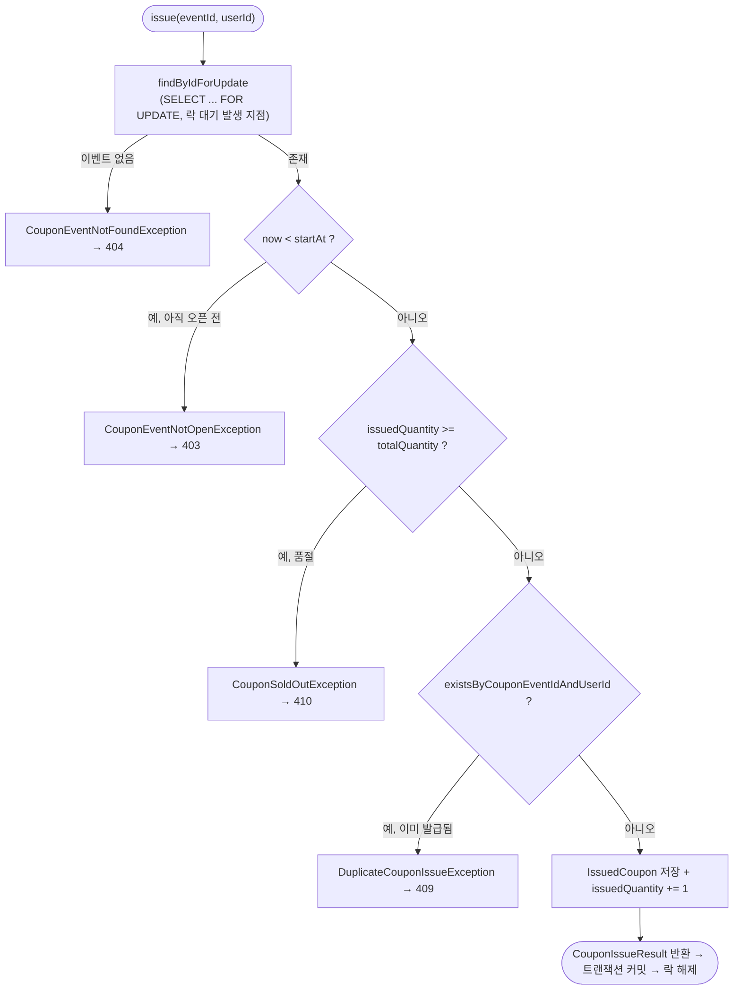

# Task 5: 쿠폰 발급 핵심 로직 (CouponIssueService)

**커밋:** `ea70c2e` Add CouponIssueService with pessimistic-lock issuance logic

## 한 일

TDD로 진행: 실패하는 테스트(`CouponIssueServiceTest`, 5개 케이스)를 먼저 작성해 컴파일 실패(클래스 없음)를 확인한 뒤 구현했다.

- `ClockConfig` — 테스트에서 시간을 고정할 수 있도록 `Clock` 빈 등록 (`Clock.systemDefaultZone()`)
- `CouponIssueService.issue(eventId, userId)` — 하나의 `@Transactional` 안에서 순서대로:
  1. `findByIdForUpdate`로 이벤트 row에 비관적 락 획득, 없으면 `CouponEventNotFoundException`
  2. 오픈 시각(`startAt`) 이전이면 `CouponEventNotOpenException`
  3. 재고 확인(`issuedQuantity >= totalQuantity`) → `CouponSoldOutException`
     (재고 확인이 중복 확인보다 먼저 오는 순서는 설계 문서 Phase 1 섹션과 일치)
  4. 중복 발급 확인(`existsByCouponEventIdAndUserId`) → `DuplicateCouponIssueException`
  5. `IssuedCoupon` 저장 + `issuedQuantity += 1`
- `CouponIssueServiceTest` — Mockito로 리포지토리를 mock, `Clock.fixed`로 시간 고정: 성공/이벤트 없음/오픈 전/품절/중복 5개 케이스

## 판정 순서 흐름도

락을 잡은 뒤부터 커밋까지 하나의 트랜잭션 안에서 순서대로 검사한다. 순서가 바뀌면 안 되는 이유: **재고 확인이 중복 확인보다 먼저** 와야 "이미 발급받은 사용자가 재요청했을 때"도 품절이면 SOLD_OUT을 우선 응답하게 되어(설계 문서 Phase 1 섹션과 동일한 우선순위), 재고 없는데 DUPLICATE로 오인시키는 걸 피한다.

HTTP 상태 코드(404/403/410/409)로의 매핑은 [Task 3](task-3-exceptions.md)의 `GlobalExceptionHandler`가 담당하며, 전체 요청 흐름은 [Task 6](task-6-issue-api.md)에서 이어진다.

## 계획과 다른 점

없음 — 계획 그대로 진행됨.

## 검증

- `./gradlew test --tests "jh.couponevent.coupon.application.CouponIssueServiceTest"` → 먼저 컴파일 실패 확인(RED) → 구현 후 `BUILD SUCCESSFUL`, 5 tests passed(GREEN)
