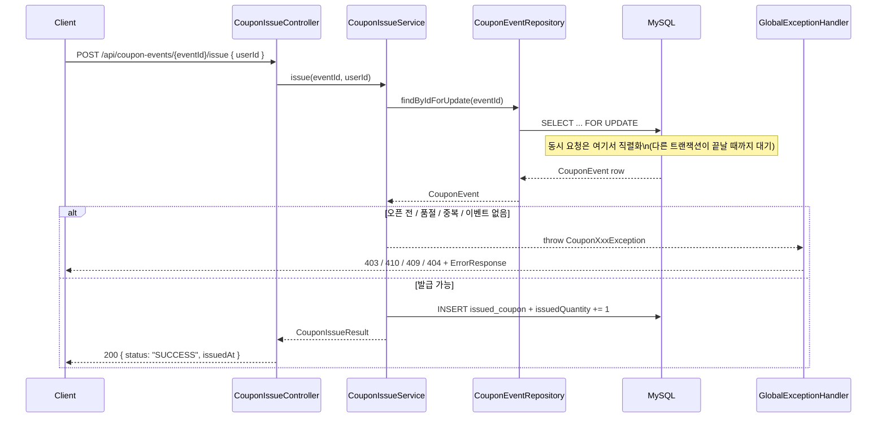

# Task 6: 쿠폰 발급 API (CouponIssueController)

**커밋:** `64e3083` Add coupon issue API endpoint with exception-to-status mapping

## 한 일

- DTO: `CouponIssueRequest(@Positive userId)`, `CouponIssueResponse(status, issuedAt)`, `CouponStatusResponse(issued)`
- `CouponIssueController`
  - `POST /api/coupon-events/{eventId}/issue` → `CouponIssueService.issue` 호출, 성공 시 `SUCCESS` 응답
    (실패 시 Task 3의 `GlobalExceptionHandler`가 403/404/409/410으로 매핑)
  - `GET /api/coupon-events/{eventId}/users/{userId}/status` → `existsByCouponEventIdAndUserId` 결과 반환
- `CouponIssueControllerTest` — `@WebMvcTest`로 컨트롤러 계층만 띄우고 서비스/리포지토리는 `@MockitoBean`으로 대체,
  실제 HTTP 요청을 보내 예외 → HTTP 상태 매핑까지 검증 (품절 시 410/SOLD_OUT, 성공 시 200/SUCCESS)
- 전체 스위트(`./gradlew test`) 재실행해 이전 Task 결과물과 충돌 없음을 확인

## 요청~응답 흐름

Task 5의 판정 로직이 실제 HTTP 요청 안에서 어떻게 성공/실패 응답으로 이어지는지 정리하면 다음과 같다.

`@WebMvcTest`를 쓴 이유: `CouponIssueService`/`IssuedCouponRepository`를 `@MockitoBean`으로 대체해 컨트롤러~예외 핸들러 구간만 웹 계층에 실제로 띄워 검증하기 위함이다. `@SpringBootTest`로 전체 컨텍스트를 올리는 것보다 가볍고, DB 상태에 의존하지 않아 테스트가 빠르고 결정적(deterministic)이다.

## 계획과 다른 점

`@WebMvcTest`를 처음 사용하면서 Spring Boot 4.1.0의 두 가지 구조 변경과 충돌해 계획에 없던 수정이 필요했다.

1. **테스트 슬라이스 모듈 분리** — `@WebMvcTest`가 `spring-boot-test-autoconfigure`가 아니라 별도 모듈
   `spring-boot-webmvc-test`에 있고, 그마저 `build.gradle.kts`에 없어 컴파일 자체가 안 됐다.
   - `testImplementation("org.springframework.boot:spring-boot-starter-webmvc-test")` 추가
   - import: `org.springframework.boot.webmvc.test.autoconfigure.WebMvcTest` (계획의
     `org.springframework.boot.test.autoconfigure.web.servlet.WebMvcTest` 아님)
2. **Jackson 3 전환** — Spring Boot 4.1은 Jackson 2(`com.fasterxml.jackson`)가 아니라 Jackson 3
   (`tools.jackson`, groupId도 `tools.jackson.core`)를 쓴다. 테스트에서 요청 바디를 직렬화하려고 쓴
   `ObjectMapper`의 import를 `tools.jackson.databind.ObjectMapper`로 변경했다.

원인 파악 과정: `./gradlew dependencies --configuration testCompileClasspath`로 실제 해석된 의존성 트리를 확인하고,
`~/.gradle/caches`에 캐싱된 jar 내부 클래스 목록을 `unzip -l`로 직접 뒤져 새 패키지 경로를 확인했다.

## 검증

- `./gradlew test --tests "jh.couponevent.coupon.api.CouponIssueControllerTest"` → `BUILD SUCCESSFUL`, 2 tests passed
- `./gradlew test` (전체 스위트) → `BUILD SUCCESSFUL`
