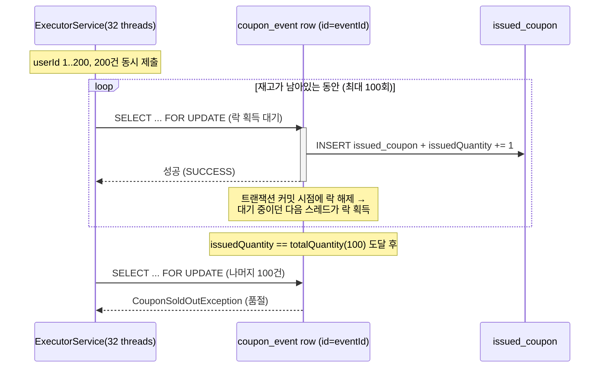

# Task 7: 동시성 통합 테스트 (실제 MySQL 락 경합 검증)

**커밋:** `992bc5c` Add concurrency integration test against real MySQL

## 한 일

- `CouponIssueConcurrencyTest` — `@SpringBootTest`로 전체 컨텍스트를 띄우고 실제 빈(`CouponIssueService`,
  리포지토리들)을 사용, 실제 로컬 MySQL(docker-compose)에 대해 검증
- 시나리오: 재고 100개짜리 이벤트를 만들고, 32개 스레드 풀로 서로 다른 사용자 200명이 동시에 발급 요청
- 검증: 성공 100건, 실패(품절) 100건, `IssuedCouponRepository.countByCouponEventId`로 DB에 실제 저장된 row 수도 정확히 100건임을 확인 — 비관적 락이 초과 발급을 막는다는 것을 실제 DB 레벨에서 증명

## 동시성 처리 흐름

32개 스레드가 같은 이벤트 row 하나를 두고 락을 다투기 때문에, 애플리케이션 코드 레벨의 동시성 제어 없이도 MySQL이 요청을 한 줄로 세운다.

락 자체가 큐 역할을 하므로 애플리케이션은 "몇 번째로 도착했는지"를 신경 쓸 필요가 없다 — 대신 그 대가로 대기 시간이 응답 지연으로 그대로 나타난다는 게 [Task 8](task-8-load-test.md)의 관찰 포인트다.

스레드 풀을 32개로, 요청을 재고(100)의 2배인 200건으로 잡은 이유: 스레드 수가 너무 적으면 락 대기 자체가 거의 발생하지 않아 경합 상황을 재현하기 어렵고, 요청 수를 재고와 똑같이 잡으면 "실패 케이스"(품절)가 전혀 나오지 않아 예외 처리 경로가 검증되지 않는다.

## 계획과 다른 점

없음 — 계획 그대로 진행됨. (참고: 이 테스트는 실행마다 새 이벤트 row를 만들어 로컬 DB에 데이터가 누적된다 — 학습용 로컬 DB라 정리는 선택 사항이며, 필요하면 `docker compose down -v && docker compose up -d`로 초기화)

## 검증

- MySQL 기동 확인: `docker compose up -d && docker compose ps` → `mysql` 서비스 `running`
- `./gradlew test --tests "jh.couponevent.coupon.application.CouponIssueConcurrencyTest"` → `BUILD SUCCESSFUL`, 1 test passed
  (성공 100 / 실패 100 / DB row 100 정확히 일치)
