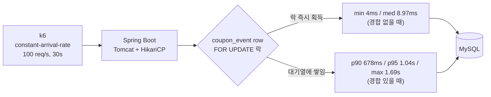

# Task 8: k6 부하테스트 (~100 TPS 병목 실측)

**커밋:** `3abaf75` Add k6 load test script for Phase 1 bottleneck observation

## 한 일

- `load-test/k6/phase1-issue.js` — `constant-arrival-rate` executor로 100 req/s, 30초 동안
  `POST /api/coupon-events/{eventId}/issue` 호출, 응답 상태가 200/409/410 중 하나인지만 체크
  (품절이 아니라 락 경합을 관찰하는 게 목적이라 재고는 5000개로 넉넉히 잡음)
- `load-test/README.md` — 실행 방법 + 실측 결과 기록
- 실제로 앱을 기동(`docker compose up -d && ./gradlew bootRun`)하고, 관리자 API로 이벤트(`totalQuantity=5000`)를
  생성한 뒤 `EVENT_ID=<id> k6 run load-test/k6/phase1-issue.js`로 부하테스트를 실행해 결과를 관찰함

## 병목 지점

k6의 `constant-arrival-rate` executor는 "초당 100건이 도착해야 한다"는 목표를 맞추기 위해 필요하면 VU를 늘려가며(최대 `maxVUs`) 새 반복을 시작한다. 그런데 이전 반복이 락 대기로 아직 안 끝났으면 그 VU는 응답을 기다리느라 묶여 있고, `preAllocatedVUs`/`maxVUs`로 정한 한도 내에서 새 VU를 더 못 만들면 목표 시각에 새 반복을 아예 시작하지 못한 채 `dropped_iterations`로 집계된다. 즉 이 지표 자체가 "락 대기 때문에 처리 능력이 도착률을 못 따라간다"는 걸 보여주는 신호다.

## 실측 결과 (2026-07-06)

- 목표: 100 req/s × 30s
- 실제 처리량: **97.77 req/s** (2934 requests), `dropped_iterations` **67건**(2.23/s)
  — 사전 할당된 VU가 이전 요청의 락 대기로 묶여 있어 새 반복을 제때 시작하지 못함
- 응답 시간: `avg` 148.78ms, `p90` 678.18ms, **`p95` 1.04s**, **`max` 1.69s**
  (반면 `min`/`med`는 각각 4ms/8.97ms 수준 — 락 경합이 없을 때는 매우 빠르다는 뜻)
- `http_req_failed`: 0% — 에러 응답은 없었지만 지연 시간 분포가 매우 넓게 벌어짐 (락 대기 시간이 그대로 응답 지연으로 전가됨)
- 서버 로그에서 명시적인 HikariCP 커넥션 타임아웃(`Connection is not available`)은 관찰되지 않음 —
  이번 실측에서는 커넥션 풀 고갈보다 **락 대기 자체의 지연 시간 증가**가 먼저 드러난 병목

## 계획과 다른 점

없음 — 계획 그대로 진행됨. (계획에서 예상한 "HikariCP 커넥션 타임아웃"은 이번 실측에서는 나타나지 않았고,
대신 p95/p99 지연 시간 폭증과 `dropped_iterations`가 관찰됨 — 결론은 동일: 비관적 락에 의한 직렬화가 병목)

## 결론

`SELECT ... FOR UPDATE` 비관적 락은 동일 이벤트 row에 대한 모든 발급 요청을 직렬화하므로, ~100 TPS 수준에서 이미
p95/p99 지연 시간이 초 단위로 벌어지고 일부 요청이 처리 큐에서 밀려 드롭된다. 이것이 Phase 1의 예상된 병목이며,
Redis 기반 원자적 재고 차감(Phase 2)으로 전환할 근거가 된다.
