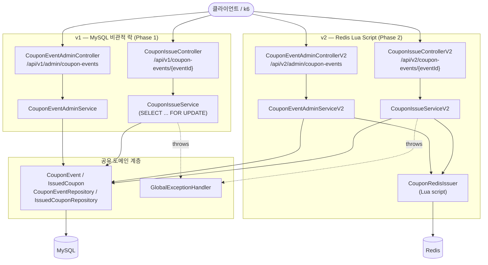
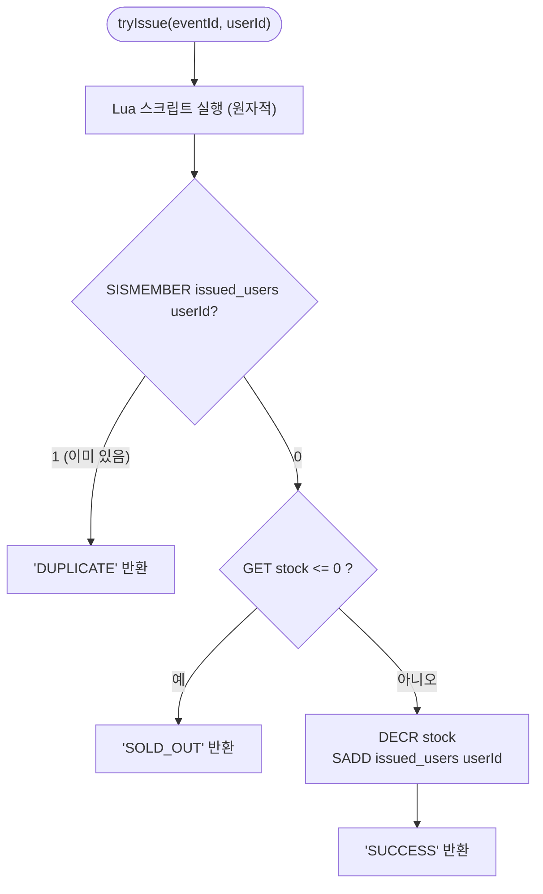
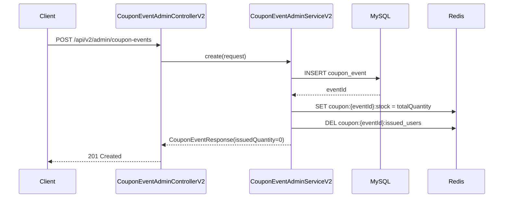
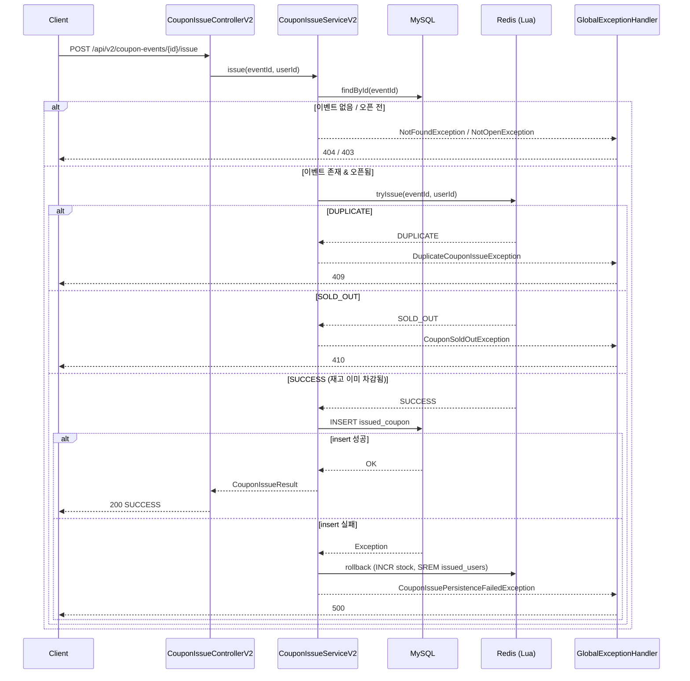
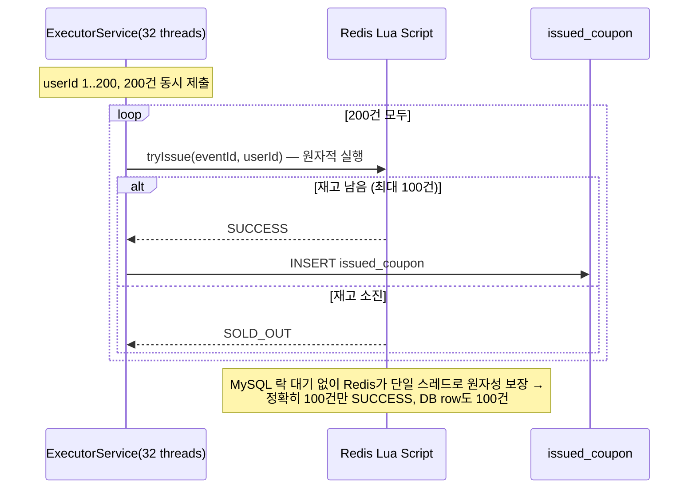
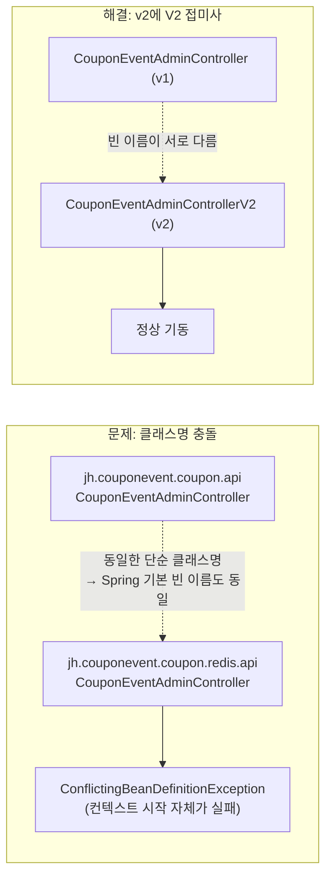
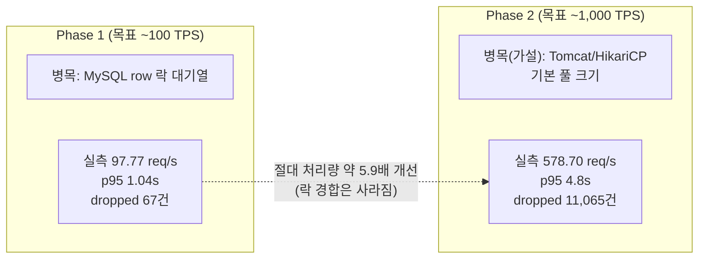

# Phase 2 (Redis Lua Script) 구현 결과 요약

- 계획: `docs/superpowers/plans/2026-07-11-phase2-redis-lua.md`
- 스펙: `docs/superpowers/specs/2026-07-11-phase2-redis-lua-design.md`
- 브랜치: `phase2-redis-lua`
- PR: [#2 Phase 2: Redis Lua Script 기반 원자적 쿠폰 발급 (~1,000 TPS)](https://github.com/JuHyun419/coupon-events/pull/2)
- 손으로 직접 확인해보고 싶다면: [manual-testing-guide.md](manual-testing-guide.md)

## 전체 아키텍처

Phase 1(v1, MySQL 비관적 락)은 그대로 두고, Phase 2(v2, Redis Lua Script)를 병렬로 추가했다. 엔티티/리포지토리/예외 핸들러는 v1·v2가 공유하고, "재고를 어떻게 지키는가"만 다르다.

v1과 v2 클래스가 처음엔 같은 단순 클래스명(`CouponEventAdminController` 등)을 썼는데, Spring의 기본 빈 이름이 패키지와 무관하게 단순 클래스명만 본다는 걸 놓쳐서 실제로 앱이 기동조차 안 되는 버그가 났었다 — 자세한 경위는 [계획 문서 Task 7 amendment](../../plans/2026-07-11-phase2-redis-lua.md) 참고, 요약 다이어그램은 아래 "겪은 문제" 절 참고.

## Redis 키 설계 & Lua 스크립트 원자성

재고 확인·중복 체크·차감을 하나의 Lua 스크립트로 묶어서 "확인 후 차감" 사이에 다른 요청이 끼어들 수 없게 만들었다(Redis는 스크립트 실행 중 단일 스레드로 동작).

키: `coupon:{eventId}:stock`(잔여 재고), `coupon:{eventId}:issued_users`(발급자 Set).

## 이벤트 생성 흐름 (Redis 자동 시딩)

관리자가 이벤트를 만드는 순간 MySQL insert와 Redis 시딩이 한 요청 안에서 함께 일어난다 — 별도 "활성화" 단계가 없다.

관리자 조회(`GET`)의 `issuedQuantity`는 DB 컬럼이 아니라 매번 `totalQuantity - Redis stock`으로 역산한다 — `coupon_event.issued_quantity`는 v2 경로에서 절대 쓰지 않는다.

## 발급 요청 흐름 (성공 / 실패 / 영속화 실패 보상 처리)

Lua 스크립트가 이미 `SUCCESS`를 반환한 뒤(=Redis 재고는 이미 차감된 뒤) MySQL insert가 실패하면, Redis를 롤백(`INCR`+`SREM`)해서 재고가 "먹튀"되지 않게 막는다.

## 동시성 검증 (실제 Redis 대상)

MySQL 락 대신 Redis Lua의 원자성이 초과 발급을 막는다는 걸 실제 Redis로 검증했다 — 재고 100개 / 동시 요청 200건 → 정확히 100건 성공.

## 겪은 문제: v1/v2 클래스명 충돌

구현 도중 전체 테스트 스위트를 돌렸다가 앱 컨텍스트 자체가 안 뜨는 버그를 발견했다. Spring은 `@Component` 계열 빈의 기본 이름을 패키지 없이 단순 클래스명으로만 정하는데, v1/v2가 대칭성을 위해 같은 클래스명(`CouponEventAdminController` 등)을 쓰고 있었던 게 원인이었다.

v1은 그대로 두고 v2의 `@Service`/`@RestController` 클래스만 `V2` 접미사로 리네임해서 해결했다(`CouponEventAdminControllerV2`, `CouponEventAdminServiceV2`, `CouponIssueServiceV2`, `CouponIssueControllerV2`). 계획서에도 이 사고 경위를 amendment로 남겨뒀다.

## 부하테스트: Phase 1 대비 어디가 나아지고 어디가 병목인지

Redis Lua 자체는 MySQL row 락 경합을 없앴지만, 요청마다 여전히 동기적으로 MySQL SELECT+INSERT를 거치고 앱이 Tomcat/HikariCP 기본 풀 크기(스레드 200, 커넥션 10)인 단일 인스턴스로 떠 있어서 1,000 TPS 목표에는 못 미쳤다(실측 578.70 req/s, 목표 대비 약 58%). 이 원인 분석은 실제로 풀 사용률을 측정해 확인한 게 아니라 정황(에러율 0%, 높은 지연, VU 부족 경고)에 기반한 가설임을 `load-test/README.md`에 명시해뒀다. 자세한 수치는 `load-test/README.md`의 "Phase 2: Redis Lua Script (~1,000 TPS)" 절 참고.

## 최종 검증 결과

- `./gradlew test` 전체 스위트 통과 (단위 + Redis/MySQL 대상 통합 테스트 포함), `--rerun`으로 독립 재검증
- 동시성 통합 테스트: 재고 100개 / 동시 요청 200건 → 정확히 100건 성공, Redis 잔여 재고 0
- k6 부하테스트 (~1,000 TPS 목표, 30초): 실제 처리량 578.70 req/s, p95 4.8s, dropped_iterations 11,065건 — Phase 1 대비 절대 처리량 약 5.9배, 목표 대비는 약 58%
- 10개 Task 각각 구현→리뷰(spec+quality) 통과, 최종 전체 브랜치 리뷰(opus)에서 Critical/Important 0건, "Ready to merge: Yes"

## 다음 단계

Phase 3(Redis 동기 차감 + Kafka 비동기 영속화, ~10,000 TPS)는 이 보고서의 범위 밖이며, Phase 2에서 드러난 "동기 MySQL insert + 기본 풀 크기" 한계를 근거로 별도 계획 문서로 착수한다.
