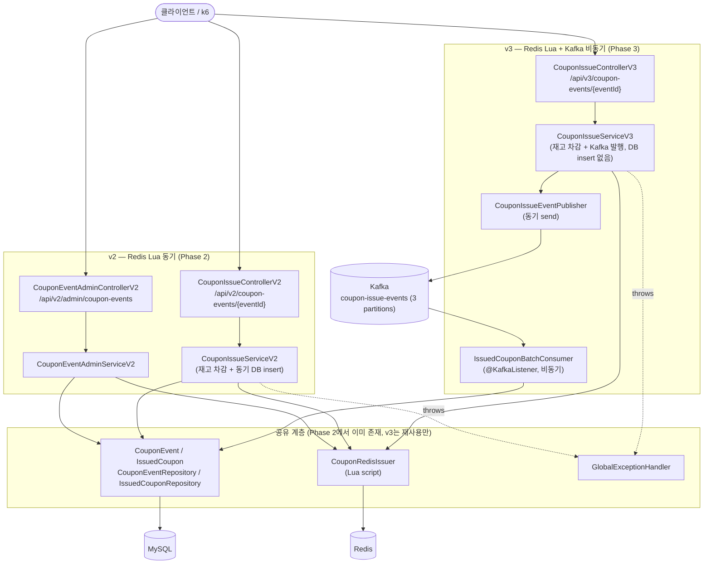
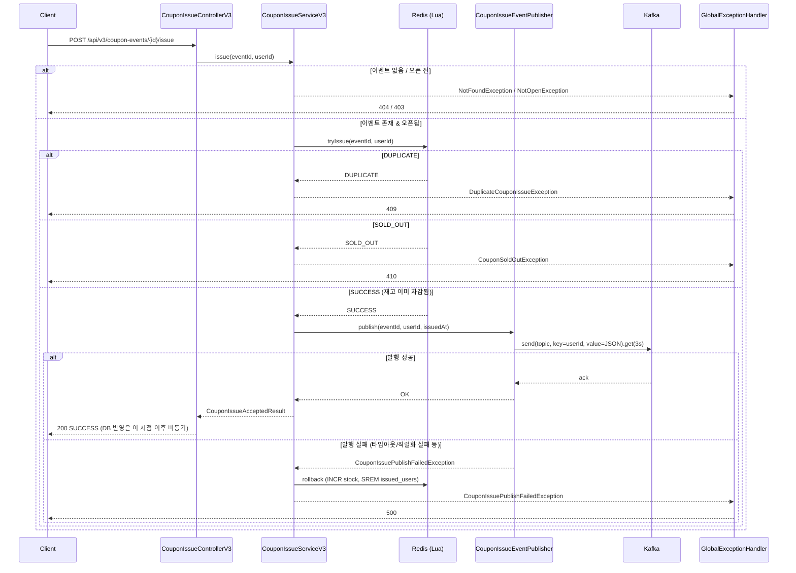
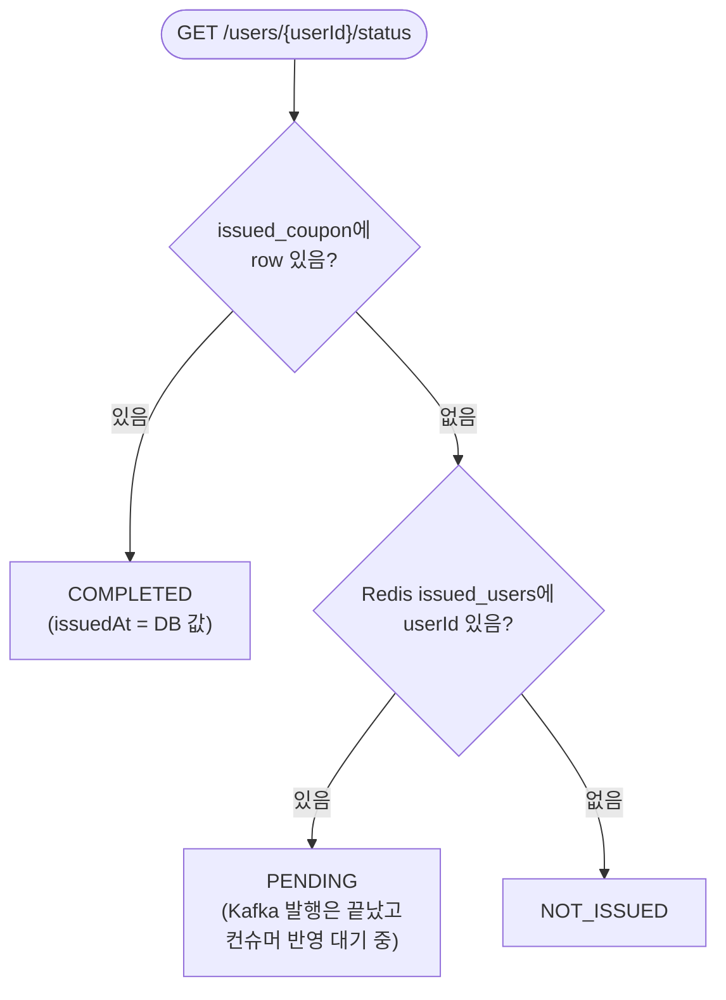
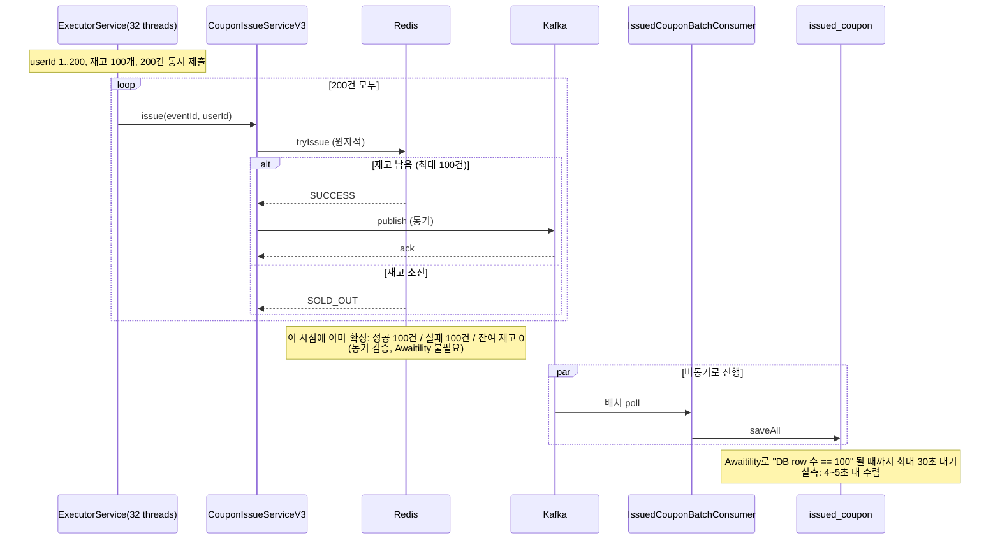
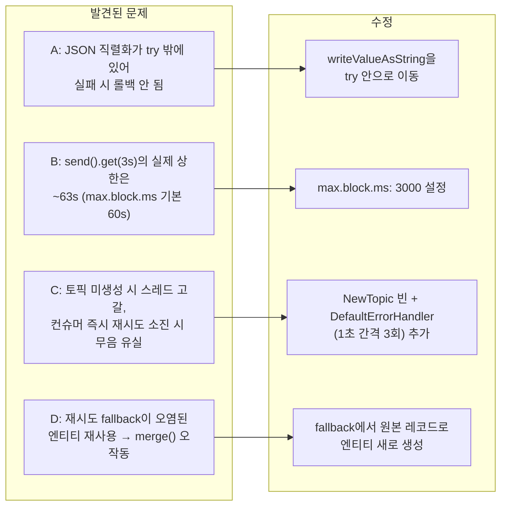
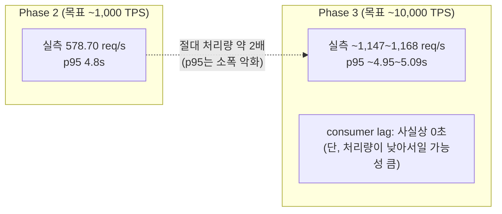

# Phase 3 (Redis 동기 차감 + Kafka 비동기 영속화) 구현 결과 요약

- 계획: `docs/superpowers/plans/2026-08-13-phase3-kafka-async.md`
- 스펙: `docs/superpowers/specs/2026-08-13-phase3-kafka-async-design.md`
- 브랜치: `main` (Phase 2와 동일하게 워크트리 없이 직접 작업)
- 손으로 직접 확인해보고 싶다면: [manual-testing-guide.md](manual-testing-guide.md)

## 전체 아키텍처

Phase 1(v1, MySQL 락)·Phase 2(v2, Redis Lua 동기)는 그대로 두고 Phase 3(v3, Redis Lua 동기 + Kafka 비동기 영속화)를 병렬로 추가했다. v3는 관리자 API를 따로 만들지 않고 v2의 것을 그대로 재사용한다 — 이벤트 생성 시 Redis 시딩 로직이 v2와 100% 동일하기 때문이다.



v3에서 새로 만든 코드는 `jh.couponevent.coupon.kafka` 패키지(`api`/`application`/`consumer`/`config`) 아래에만 있다 — Phase 2의 `CouponRedisIssuer`, 도메인 엔티티/리포지토리, `GlobalExceptionHandler`는 패키지 재배치 없이 그대로 import해서 쓴다.

## 발급 요청 흐름 — 동기 Redis 차감 + 동기 Kafka 발행, DB insert는 없음

Phase 2와 가장 크게 다른 지점: `SUCCESS`가 나온 뒤 `issued_coupon`에 바로 INSERT하지 않고, Kafka로 발행만 하고 즉시 응답한다. 발행 자체는 `KafkaTemplate.send(...).get(3, TimeUnit.SECONDS)`로 "동기식"이라 — producer가 실제로 브로커에 쓰는 것까지 확인하고 기다린 뒤 응답한다.



**알려진 한계**: `.get(3s)`가 타임아웃돼도 이미 브로커로 보낸 프로듀서 요청 자체가 취소되는 건 아니다. 타임아웃 이후 브로커가 실제로는 메시지를 정상 적재하면, 애플리케이션은 이미 500과 함께 Redis를 롤백했는데 컨슈머는 그 메시지를 읽어 DB에 반영해버리는 레이스가 이론적으로 남는다 — 최종 리뷰에서 지적된 사항이며, 코드로 막기보다 설계 문서(`2026-08-13-phase3-kafka-async-design.md` 3장)에 알려진 한계로 명시해뒀다.

## 비동기 영속화 — 배치 컨슈머

발행된 메시지는 별도 컨슈머가 배치로 모아 DB에 반영한다. `saveAll`이 UNIQUE 제약(at-least-once 재처리로 인한 중복)으로 실패하면 1건씩 재시도해서 정상 row는 살린다.

```mermaid
flowchart TD
    Poll["@KafkaListener batch poll<br/>(max-poll-records=500, fetch-max-wait=200ms)"] --> Parse["각 레코드를 CouponIssueEvent로 역직렬화<br/>→ IssuedCoupon 엔티티로 변환"]
    Parse --> SaveAll["issuedCouponRepository.saveAll(...)"]
    SaveAll -->|성공| Ack["ack.acknowledge()"]
    SaveAll -->|DataIntegrityViolationException<br/>(중복 row 포함)| Fallback["레코드마다 새로 역직렬화해<br/>1건씩 save() 재시도<br/>(IDENTITY id 오염 방지 위해 원본 레코드부터 재구성)"]
    Fallback --> Ack
    SaveAll -->|그 외 예외 (일시적 DB 오류 등)| ErrHandler["DefaultErrorHandler<br/>(1초 간격 3회 재시도)"]
    ErrHandler -->|재시도 소진| Log["로그만 남기고 다음 배치로<br/>(알려진 한계 — poison-pill/영구 장애는<br/>이 프로젝트 범위 밖)"]
```

`issued_coupon.uk_event_user` UNIQUE 제약이 재처리 시 중복 insert를 막는 최종 방어선이다. `DefaultErrorHandler`와 `NewTopic` 자동 생성 빈은 최종 브랜치 리뷰에서 추가된 것으로, 아래 "최종 리뷰에서 발견된 문제" 절 참고.

## 상태 조회 — 최종 정합성을 직접 관찰하는 용도



DB를 먼저 확인하는 이유: DB에 row가 있다는 것 자체가 컨슈머가 이미 반영을 끝냈다는 확정적 증거이기 때문이다. Redis 확인은 "아직 반영 전이지만 발급은 확정됐다"는 걸 구분하기 위한 보조 신호다.

## 동시성 + 최종 정합성 통합 테스트 (실제 Redis/Kafka/MySQL 대상)



성공한 userId를 하드코딩(`1L`)하지 않고 실제 성공 목록에서 뽑아 상태 조회까지 검증하도록 태스크 리뷰 과정에서 수정했다(스레드풀 크기·재고 수량의 우연한 조합에 의존하던 취약한 가정을 제거).

## 최종 리뷰에서 발견된 문제 — 컴펜세이팅 트랜잭션의 빈틈

10개 태스크가 모두 개별 리뷰를 통과한 뒤, 최종 전체 브랜치 리뷰(가장 강력한 모델)에서 태스크 단위 리뷰로는 보이지 않던 교차 지점의 문제 4가지가 발견됐다 — Redis/Kafka/DB 세 시스템의 정합성 이야기를 한 번에 놓고 봐야만 드러나는 것들이었다.



4건 모두 하나의 fix로 묶어 수정하고 스코프 지정 재검토를 통과했다. 타임아웃-롤백 사이의 근본적인 레이스(위 "알려진 한계") 자체는 코드로 완전히 막을 수 없어 설계 문서에 명시하는 것으로 처리했다.

## 부하테스트: Phase 2 대비 실측



응답 경로에서 동기 DB insert를 제거했음에도 목표(10,000 req/s)에는 크게 못 미쳤고(실측 약 1,150 req/s, 목표 대비 약 11~12%), p95 지연도 Phase 2보다 오히려 소폭 나빠졌다(4.8s → ~5s) — "DB insert를 빼면 빨라질 것"이라는 사전 기대와 반대되는 결과다. 응답 경로에 여전히 남아있는 Redis Lua 호출과 Kafka 프로듀서의 동기 ack 대기, 그리고 Phase 2와 동일한 단일 인스턴스 Tomcat/HikariCP 기본 풀 크기가 원인일 가능성이 높지만, 이번에도 직접 측정하지 않았으므로 가설로 남긴다. 반면 consumer lag(최종 정합성 도달 시간)은 사실상 0초였는데, 이는 컨슈머가 뛰어나서라기보다 프로듀서 처리량 자체가 낮아 컨슈머가 밀릴 일이 없었기 때문일 가능성이 크다는 점도 README에 명시해뒀다. 자세한 수치는 `load-test/README.md`의 "Phase 3" 절 참고.

## 최종 검증 결과

- `./gradlew test` 전체 스위트 통과 (50개 테스트, 단위 + Redis/Kafka/MySQL 대상 통합 테스트 포함), `--rerun`으로 여러 차례 독립 재검증
- 동시성 통합 테스트: 재고 100개 / 동시 요청 200건 → 정확히 100건 성공(동기), 이후 Awaitility로 DB row 100건 수렴까지 확인(비동기)
- k6 부하테스트 (~10,000 TPS 목표, 30초 × 3회): 실제 처리량 ~1,150~1,168 req/s, p95 ~5s, consumer lag 사실상 0초(단, 낮은 처리량 때문일 가능성 높음을 명시)
- 10개 Task 각각 구현→리뷰(spec+quality) 통과(Task 8은 1회 fix round 후 통과), 최종 전체 브랜치 리뷰(opus)에서 Important 4건 발견 → 1회 fix wave로 모두 수정 및 재검토 통과, "Ready to merge: With fixes" → fix 후 병합 가능 상태

## 다음 단계

세 Phase(MySQL 락 → Redis Lua → Redis + Kafka 비동기)가 모두 완료됐다. 상위 로드맵 문서(`docs/superpowers/specs/2026-07-04-coupon-event-design.md`)의 "범위 밖" 항목(정교한 모니터링, 인증/인가 등)은 별도 요구사항이 생기면 그때 새로 브레인스토밍한다.
